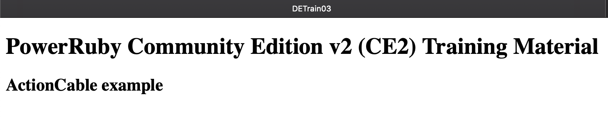

# Training Material for PowerRuby Community Edition v2

## Let us experiment with ActionCable 

ActionCable integrates **WebSockets** in the Rails framework offering a seemless experience in developing applications with *real-time* features.

I am borrowing the following image from an article by Sophie Debenedetto titled [Real-time Rails](https://blog.heroku.com/real_time_rails_implementing_websockets_in_rails_5_with_action_cable)
 
 

PowerRuby introduces another layer: **Apache**. Apache acts as a proxy/gateway when PowerRuby is configured through **RAILSNEW** command. 

Apache configuration file default name is `httpd.conf`: it is located inside the `/www/<apache_http_instance>/conf` directory. 

This is the default configuration for PowerRuby CE2 new projects:

```
##                                                                            
## PowerRuby                                                                  
##                                                                            
 LoadModule proxy_module /QSYS.LIB/QHTTPSVR.LIB/QZSRCORE.SRVPGM               
 LoadModule proxy_ftp_module /QSYS.LIB/QHTTPSVR.LIB/QZSRCORE.SRVPGM           
 LoadModule proxy_http_module /QSYS.LIB/QHTTPSVR.LIB/QZSRCORE.SRVPGM          
 LoadModule proxy_connect_module /QSYS.LIB/QHTTPSVR.LIB/QZSRCORE.SRVPGM       
#LoadModule proxy_wstunnel_module /QSYS.LIB/QHTTPSVR.LIB/QZSRCORE.SRVPGM      
 Listen *:15151                                                               
 DocumentRoot /www/ACTION/htdocs/TrainMeOnPowerRuby/current/public             
#ProxyPass /cable ws://127.0.0.1:51515/cable                                  
 ProxyPass / http://127.0.0.1:51515/                                          
 ProxyPassReverse / http://127.0.0.1:51515/                                   
```

You will notice 2 commented lines: in order to enable ActionCable you are supposed to remove the `#` in front of them and perform the following commands:

`ENDTCPSVR SERVER(*HTTP) HTTPSVR(ACTION)`

`STRTCPSVR SERVER(*HTTP) HTTPSVR(ACTION)`

When connecting with a browser we will be able again to interact with the application in the standard way: we are using the left side arrows of the previous image from *Real-time Rails* article. 

Now if we add `/cable` in the url we will **not** be re-routed to the classical *Routing Error* Rails' page.
This time the issue is different and it is detected at the Apache level:

 
  
This is due to the fact that we asked Apache to establish a **WebSockets tunnel** but the PASE WebServer (**Puma** over **Rack**) is not prepared to.


## Preparing Rails App for WebSockets

There are a number of changes that needs to be accomplished to configure even the simplest Rails app using WebSockets.
It is possible you could find this annoying and would like to get started with an example you can install out of the box.
This is the exact objective of this tutorial and project.

Refer to [DE\_train\_01](https://github.com/PowerRuby/DE_train_01/blob/master/README.md) for a detailed description of **RAILSNEW** command. The following command will install this project
on your IBM i:

```
                    Simplify usage of Rails new (RAILSNEW)             
                                                                       
Immettere le scelte e premere Invio.                                   
                                                                       
New Rails Application Name . . . > TrainMeOnPowerRuby                  
Apache HTTP Instance . . . . . . > ACTION        Character value       
Apache Instance Port . . . . . . > 15151         Number                
Ruby Web Server Port . . . . . . > 51515         Number                
Creation mode  . . . . . . . . . > *GITHUB       *NEW, *NONE, *GITHUB  
GitHub: username . . . . . . . .                                       
GitHub: password . . . . . . . .                                       
GitHub: PowerRuby: project . . .   'DE_train_03'  
                     
```

then you need to
`ENDTCPSVR SERVER(*HTTP) HTTPSVR(ACTION)`
in order to modify the **httpd.conf** (as explained in the initial paragraph) enabling **WebSockets Tunneling** feature
of Apache 2.4 (introduced with IBM i 7.2):

`LoadModule proxy_wstunnel_module /QSYS.LIB/QHTTPSVR.LIB/QZSRCORE.SRVPGM`

and configuring this service so that HTTP requests for **/cable** are reserved to WebSockets handling (UPGRADE requests):

`ProxyPass /cable ws://127.0.0.1:51515/cable`

We can restart the HTTP server: `STRTCPSVR SERVER(*HTTP) HTTPSVR(ACTION)`

If we now connect from the browser (using the port number we adopted in RAILSNEW)
we will not notice if WebSockets are successfully established or not. 

 

Each browser has its own interfaces to verify WebSockets status.
The browser developmnt tools are definetely relevant when working with WebSockets but, right now, we prefer to investigate the result of the HTTP UPGRADE request originated by the browser by means of the JavaScript (or CoffeeScript) we introduced in our skinny project.

By checking the messages logged at the end of **development.log** we will find an endless repetition of the following 4 lines:

```
Started GET "/cable/" [WebSocket] for 127.0.0.1 at 2018-10-26 08:38:43 +1345                             
Request origin not allowed: http://192.168.168.76:15151                                                  
Failed to upgrade to WebSocket (REQUEST_METHOD: GET, HTTP_CONNECTION: Upgrade, HTTP_UPGRADE: WebSocket)  
Finished "/cable/" [WebSocket] for 127.0.0.1 at 2018-10-26 08:38:43 +1345                                
```

So what is missing?

## Launching Redis 

As we already evinced from the arrows in the right of *Real-time Rails* article a new block is playing a relevant role: **Redis**. Redis is *an open-source in-memory data structure project implementing a distributed, in-memory key-value database with optional durability* (from [Wikipedia](https://en.wikipedia.org/wiki/Redis)). In order to support Rails 5.1 in PASE we built a 64-bits version of **redis-server** program that is distributed in the **\*BASE** option of PowerRuby (i.e. `/PowerRuby/oss` directory).

Let us create a CL wrapper to submit Redis server in a controlled way by our IBM i operating system.

Let us edit the following CL source in a source file:

```CL
 Columns . . . :    1  80                     Browse                   PRCE2_DEVL/QCLSRC
 SEU==>                                                                         REDISSRV
 FMT **  ...+... 1 ...+... 2 ...+... 3 ...+... 4 ...+... 5 ...+... 6 ...+... 7 ...+... 8
        *************** Beginning of data **********************************************
0001.00              PGM                                                                
0002.00              DCL        VAR(&NULL) TYPE(*CHAR) LEN(1) VALUE(X'00')              
0003.00              DCL        VAR(&IFS) TYPE(*CHAR) LEN(80) +                         
0004.00                           VALUE('/PowerRuby/oss/bin/redis-server')              
0005.00              DCL        VAR(&MBR) TYPE(*CHAR) LEN(10) VALUE('REDIS64B')         
0006.00              CHGVAR     VAR(&IFS) VALUE(&IFS *TCAT &NULL)                       
0007.00              SBMJOB     CMD(CALL PGM(QP2SHELL) PARM(&IFS)) JOB(&MBR) +          
0008.00                           JOBQ(QSYS/QSYSNOMAX) CCSID(37) +                      
0009.00                           ALWMLTTHD(*YES)                                       
0010.00              ENDPGM                                                             
        ****************** End of data *************************************************
```

Once compiled and sumbitted we will forget about it ...
  
```
                           Work with Submitted Jobs                   
                                                                                                                                          
Opt  Job         User        Type     -----Status-----  Function              
     REDIS64B    PRUBYADM    BATCH    ACTIVE            PGM-redis-serv        
```

Let us try again connecting from a browser to our application. By loading the page we configured as root we will trigger again an HTTP UPGRADE request for WebSocket. 
This time our middleware is working properly and we will notice these rows at the end of the **development.log** file:

```
Started GET "/cable/" [WebSocket] for 127.0.0.1 at 2018-10-26 05:06:32 +1345
Successfully upgraded to WebSocket (REQUEST_METHOD: GET, HTTP_CONNECTION: Upgrade, HTTP_UPGRADE: WebSocket)
WebEventsChannel is transmitting the subscription confirmation
WebEventsChannel is streaming from web_events_channel
```

## Playing with the DE\_train\_03 example

Now, keeping our browser connected, we will open a 5250 session with our IBM i.
We will execute an `ADDENVVAR ENVVAR(QIBM_MULTI_THREADED) VALUE(Y)` and we will call `QSH`.
Now we will change directory to the **current** one inside our project:

```
   $                                                   
 > cd /www/ACTION/htdocs/TrainMeOnPowerRuby/current    
   /www/ACTION/htdocs/TrainMeOnPowerRuby/v03           
   $                                                   
```

then we will launch Rails console this way:

```
   $                                                         
 > /PowerRuby/prV2R4/bin/rails console                       
   Loading development environment (Rails 5.1.6)             
   irb(main):001:0>                                          
```

You are noticing that Rails console is using **Interactive Ruby** (**irb**) and once loaded will interpret our commands offering all the support specific to our project. 

As soon as we created an Action Cable channel named WebEvents (that gets encoded as **web\_events\_channel**), we have the possibility to broadcast on such a channel:

```                                                         
 > ActionCable.server.broadcast ‘web_events_channel’, event: "<p>Independently originated inside IBM i #{Time.now}</p>" 

```

As soon as the browser application is a subscriber to that channel, it will reveive notification of the event and will render it using jQuery manipulation of the DOM of our web page.  

## Understanding the code

To simplify understanding of what was needed to implement this simple example (and to become confident in building real Rails projects on your own) we published DE\_train\_03 in a series of atomic git commits that can be queried on GitHub.

The names assigned to individual commits should help. For example let us look for details of the following commit:

 

If we look for details we get the files involved and a clear presentation of the changes occurred:

 

Once you identify the `disable_request_forgery_protection` setting you will be able to search the web for details on this aspect of ActionCable and end up in identifying this [RAILSGUIDE](https://guides.rubyonrails.org/action_cable_overview.html#allowed-request-origins) on ActionCable. You are free to approach your study of Rails as you prefer. It is also possible to find formal training, but that will be presumably focused on other platforms of execution. It is up to you to adapt the knowledge you will acquire to IBM i and PowerRuby.

In case you suspect issues in PowerRuby builds contact **support@powerruby.com**. 
We are doing our best to help (or re-route requests) although this process could involve some time...

Enjoy **PowerRuby CE2**!
